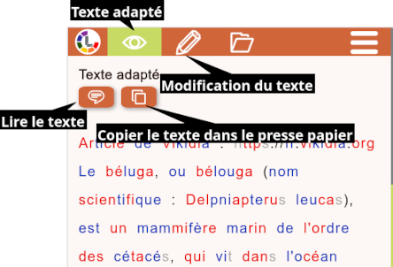
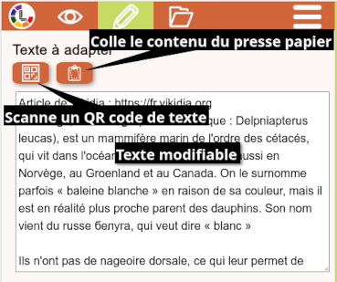

# Web LireCouleur 6

Outil de transformation de textes pour en faciliter la lecture.

LireCouleur utilise le principe de la lecture en couleurs pour faciliter la lecture en mettant en évidence les phrases, les mots, les syllabes ou les graphèmes.

## Adaptation d'un texte d'après un profil utilisateur

Accès à la fonction : https://lirecouleur.forge.apps.education.fr

Après une première ouverture sur un terminal, les fonctions d'adaptation de texte, de saisie d'un texte à adapter et de gestion des profils utilisateur sont accessibles hors ligne.

### Vue par défaut : le texte adapté



Le texte est adapté selon le profil sélectionné dans la liste des profils disponibles.

### Saisie d'un texte à adapter



Le texte à adapter peut être :

* **importé** à partir d'un fichier **texte**, **pdf** ou **docx**
* **scanné** depuis un QR code
* **collé** depuis le presse-papier
* **saisi** dans la zone de texte modifiable en utilisant le clavier

## Edition de profils utilisateurs

Accès à l'éditeur de profils : https://lirecouleur.forge.apps.education.fr/editeur.html

## Réutilisation de code

#### Adaptation de texte brut avec LireCouleur

``` js
    /**
     * fichiers nécessaires :
     * - lirecouleur.js
     * - userprofile.js
     * - functionlc6.js
     * - processlc6.js
     */

    /**
     * construction d'un objet UserProfile au format JSON
     */
    const json = '{"name":"profil","description":"profil basique","process":[{"function":"defaut"}]}';
    const profil = new UserProfile(JSON.parse(json));

    /**
     * transformation du texte brut en html suivant le profil
     * div est l'élément DOM à partir duquel sera inséré le texte adapté -- "div-texte-adapte"
     */
    const texte = "Je suis le texte à adapter";
    let div = document.getElementById("div-texte-adapte");
    let html = profil.toHTML(texte, div);

    /**
     * insertion du html du texte adapté dans le DOM à partir de l'élément "div-texte-adapte"
     * et ajustement du style de l'élément
     */
    div.innerHTML = html;
    div.style = profil.style;

    /**
     * facultatif : traitement complémentaire pour l'applications de fonctions globales
     * comme le surlignage des lignes, ou la fonction de lecture de texte
     */
    profil.postProcessHTML(div);
```

#### Adaptation de texte au format Markdown

``` js
    /**
     * fichiers nécessaires :
     * - lirecouleur.js
     * - userprofile.js
     * - functionlc6.js
     * - processlc6.js
     * - showdown.min.js
     * - showdown.min.js.map
     */

    /**
     * construction d'un objet UserProfile au format JSON
     */
    const json = '{"name":"profil","description":"profil basique","process":[{"function":"defaut"}]}';
    const profil = new UserProfile(JSON.parse(json));

    /**
     * transformation du texte brut en html suivant le profil
     * div est l'élément DOM à partir duquel sera inséré le texte adapté -- "div-texte-adapte"
     */
    const texte = "# Titre 1\n\nJe suis le texte à adapter";
    let div = document.getElementById("div-texte-adapte");
    let html = profil.toHTML(texte, div);

    /**
     * transformation du Markdown avec Showdown
     */
    let converter = new showdown.Converter();
    let nHtml = converter.makeHtml(html);

    /**
     * insertion du html du texte adapté dans le DOM à partir de l'élément "div-texte-adapte"
     * et ajustement du style de l'élément
     */
    div.innerHTML = nHtml;
    div.style = profil.style;

    /**
     * facultatif : traitement complémentaire pour l'applications de fonctions globales
     * comme le surlignage des lignes, ou la fonction de lecture de texte
     */
    profil.postProcessHTML(div);
```

## Auteurs

Luc et Marie-Pierre Brungard

## Crédits

LireCouleur est un outil libre et gratuit sous licence [GNU GPL 3](https://www.gnu.org/licenses/gpl-3.0.en.html). Les sources sont disponibles sur la Forge des Communs Numériques Éducatifs.

Ces outils sans qui tout serait beaucoup plus difficile... LireCouleur utilise d'autres logiciels libres :

* Html5-QRCode : https://github.com/mebjas/html5-qrcode pour la gestion de QR codes
* PDF.js : https://mozilla.github.io/pdf.js/ pour la lecture de fichiers PDF
* Showdown : https://github.com/showdownjs/showdown pour la conversion du markdown en HTML
* Toast UI editor : https://ui.toast.com/tui-editor pour l'édition de texte

ainsi que :

* Readability.js : https://github.com/mozilla/readability pour "retirer tout le superflu des pages web" comme dans le mode lecture de Mozilla Firefox
* Turndown : https://github.com/mixmark-io/turndown pour transformer du HTML en Markdown
* DOMPurify : https://github.com/cure53/DOMPurify pour nettoyer le code HTML


### Polices de caractères

* Luciole : https://www.luciole-vision.com/
* Accessible Dfa : https://github.com/Orange-OpenSource/font-accessible-dfa
* OpenDyslexic : https://opendyslexic.org/
* Andika : https://software.sil.org/andika/download/